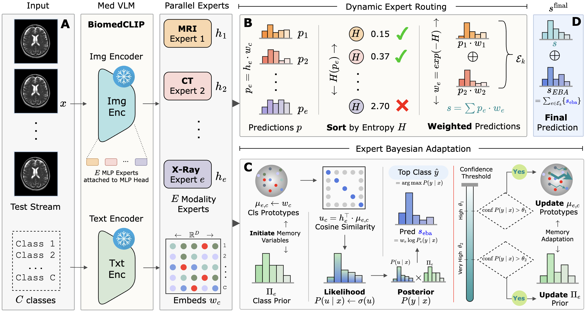

# Can Experts Adapt Without Training? On Test-Time Modality Generalization in MVLMs

[Raza Imam](https://razaimam45.github.io/), Darakshan Rashid, Yutong Xie, Dwarikanath Mahapatra, Brejesh Lall, Mohammad Yaqub

Mohamed bin Zayed University of Artificial Intelligence, Khalifa University, Indian Institute of Technology Delhi

<p align="center">
  <strong>Accepted to MICCAI 2026</strong><br>
  <a href="https://conferences.miccai.org/2026/">
    
  </a>
</p>

[](https://arxiv.org/abs/2607.16726)
[](assets/MoBE.pdf)

This repository provides the official PyTorch implementation of our MoBE paper:

> Can Experts Adapt Without Training? On Test-Time Modality Generalization in MVLMs  
> Authors: *Raza Imam, Darakshan Rashid, Yutong Xie, Dwarikanath Mahapatra, Brejesh Lall, Mohammad Yaqub*

<p align="center">
  
</p>
<p align="center">
MoBE performs optimization-free test-time routing and Bayesian adaptation over modality-specialized medical VLM experts.
</p>

For more details, please check out our [<ins>**paper**</ins>](https://arxiv.org/abs/2607.16726) or the local PDF at [`assets/MoBE.pdf`](assets/MoBE.pdf).

## Overview

Medical vision-language models can lose reliability when test images come from unseen modalities, scanners, or clinical domains. MoBE addresses this setting with a training-free mixture-of-experts framework for medical VLMs.

MoBE has two main components:

* **Dynamic-k entropy-guided routing:** select modality experts whose predictive uncertainty is close to the most confident expert.
* **Expert Bayesian Adaptation:** maintain expert-wise online prototypes and priors, adapting predictions from the test stream without gradient updates.

**Start here:** Explore [`example.ipynb`](example.ipynb) for a quick, hands-on MoBE tutorial with guided steps, bundled medical images, and interactive visualizations.

## Repository Layout

```text
MoBE-A-Test-Time-Modality-Generalization-Method/
├── README.md
├── example.ipynb
├── requirements.txt
├── mobe.py
├── utils.py
├── assets/
├── baselines/
│   ├── __init__.py
│   ├── biomedclip.py
│   ├── mome.py
│   ├── tda.py
│   └── tpt.py
├── configs/
├── datasets/
│   ├── __init__.py
│   ├── bloodmnist.py
│   ├── ...
├── datasets_all/
│   ├── hardbench/
│   └── medmnist/
├── experts/
├── scripts/
│   ├── ...
│   ├── run_mobe.sh
│   └── ...
└── tools/
```

## Prerequisites

### Hardware

This implementation is intended for a single-GPU setup. The paper evaluates with batch size 1 on an NVIDIA A6000. Smaller datasets may run on lower-memory GPUs, but MoBE evaluates multiple experts per sample and is therefore heavier than single-model BiomedCLIP inference.

### Environment

```bash
conda create -n mobe python=3.9 -y
conda activate mobe
pip install -r requirements.txt
```

## Datasets

The repository keeps dataset folders empty so users can download datasets themselves. See [`assets/datasets.md`](assets/datasets.md) for the full dataset preparation guide.

## Single-Image Notebook

[`example.ipynb`](example.ipynb) is the quickest way to experience the full workflow before downloading any dataset. It uses six bundled images under [`assets/samples/`](assets/samples/) from COVID-19, BTMRI, and DermaMNIST, with an interactive sample picker, dataset-specific labels, CLIP-style confidence visualizations, dynamic-k expert routing, Expert Bayesian Adaptation controls, and a live single-dataset panel comparing BiomedCLIP and MoBE accuracy/confidence as inference progresses.

## Experts

Download the modality expert checkpoints from:

[https://drive.google.com/drive/folders/1kVtrf3XBYQMSUQbJBoynLgEzKFau6Zij?usp=drive_link](https://drive.google.com/drive/folders/1kVtrf3XBYQMSUQbJBoynLgEzKFau6Zij?usp=drive_link)

Place them under `experts/` with filenames like:

```text
experts/expert_Angiogram_0.pt
experts/expert_CT_0.pt
experts/expert_MRI_0.pt
experts/expert_Ultrasound_0.pt
experts/expert_Xray_0.pt
```

To prepare ROCOv2 data and train experts locally (optional):

```bash
scripts/download_roco.sh
SPLIT=validation scripts/download_roco.sh
scripts/train_experts.sh
```

## Run MoBE

We provide shell scripts under `scripts/`.

Run MoBE:

```bash
scripts/run_mobe.sh
```

To evaluate multiple datasets in one run:

```bash
DATASETS="hardbench_kneexray/hardbench_busi/breastmnist_224/pathmnist_224" scripts/run_mobe.sh
```

Dataset-specific MoBE hyperparameters are stored in `configs/`.

Note: dataset arguments must be slash-separated config names without the `.yaml` extension. For example, use `hardbench_kneexray/breastmnist_224`, not `hardbench_kneexray.yaml,breastmnist_224.yaml`.

## Run Baselines

Available baselines:

```bash
scripts/run_baseline.sh biomedclip
scripts/run_baseline.sh tda
scripts/run_baseline.sh tpt
scripts/run_baseline.sh mome
```

## Main Results

### Quantitative Results

<div align="center">

| Benchmark | BiomedCLIP | TDA | MoME | MoBE |
|---|:---:|:---:|:---:|:---:|
| Seen MedMNIST + MedVTAB Avg. | 33.00 | 36.20 | 38.69 | **43.41** |
| Unseen MedMNIST Avg. | 20.49 | 22.56 | 30.99 | **38.16** |
| Heterogeneous Medical Avg. | 39.24 | 42.19 | - | **46.49** |

</div>

MoBE improves over strong test-time adaptation baselines while requiring no gradient updates during inference. In the paper, MoBE reports average gains of +4.72, +7.17, and +4.30 over prior TTA methods across seen, unseen, and heterogeneous medical benchmarks.

### Computation

MoBE is inference-only and avoids backpropagation. It is slower than single-model BiomedCLIP because it forwards multiple modality experts, but it avoids optimization-based test-time adaptation overhead.

<div align="center">

| Method | No Backprop? | ChestMNIST Accuracy |
|---|:---:|:---:|
| BiomedCLIP | Yes | 53.29 |
| MoME | No | 54.72 |
| MoBE | Yes | **60.44** |

</div>

## Citation

If you find our code useful or our work relevant, please consider citing:

```bibtex
@misc{imam2026expertsadapttrainingtesttime,
      title={Can Experts Adapt Without Training? On Test-Time Modality Generalization in MVLMs}, 
      author={Raza Imam and Darakshan Rashid and Yutong Xie and Dwarikanath Mahapatra and Brejesh Lall and Mohammad Yaqub},
      year={2026},
      eprint={2607.16726},
      archivePrefix={arXiv},
      primaryClass={cs.CV},
      url={https://arxiv.org/abs/2607.16726}, 
}
```

## Acknowledgements

We thank the authors of BiomedCLIP, TDA, TPT, and MoME for their work on medical vision-language models and test-time adaptation.
